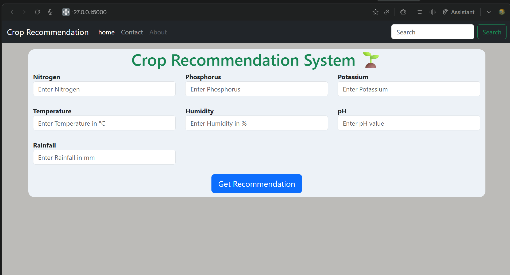
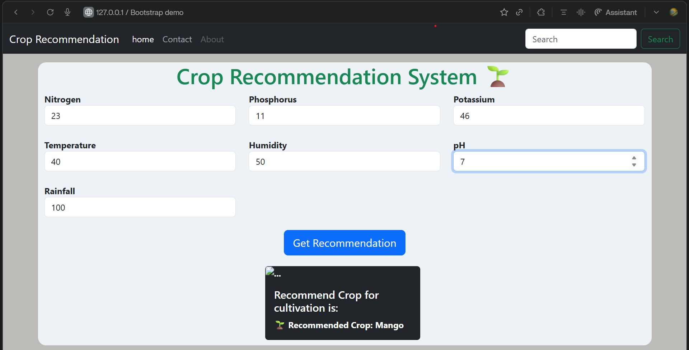

#  Crop Recommendation System

> **An intelligent crop recommendation web application built with Flask and Machine Learning. Input soil and weather parameters to get instant crop suggestions powered by a trained Random Forest model.**

## Table of Contents

- [About the Project](#-about-the-project)
- [Features](#-features)
- [Tech Stack](#-tech-stack)
- [Screenshots](#-screenshots)
- [Installation](#-installation)
- [Usage](#-usage)
- [Project Structure](#-project-structure)
- [Dataset](#-dataset)
- [How It Works](#-how-it-works)
- [Contributing](#-contributing)
- [License](#-license)

## About the Project

The **Crop Recommendation System** is a full-stack machine learning application that helps farmers and agricultural planners make data-driven decisions about crop selection. By analyzing key soil nutrients (Nitrogen, Phosphorus, Potassium) along with environmental factors (Temperature, Humidity, pH, Rainfall), the system predicts the most suitable crop to grow.

This project demonstrates the integration of:
- **Machine Learning** (Random Forest Classifier)
- **Web Development** (Flask backend + Bootstrap UI)
- **Data Preprocessing** (StandardScaler + MinMaxScaler)
- **Model Serialization** (joblib for persistence)

## Features

- Predicts **22 different crops** based on soil and climate data
- Clean, responsive **Bootstrap-based web interface**
- **Dual-scaling pipeline** (MinMax + Standard Scaler) for optimal model performance
- **Pre-trained model** with saved scalers for instant deployment
- Built-in **error handling** with user-friendly feedback
- **Jupyter Notebook** included for model training and experimentation

---

##  Tech Stack

| Category | Technology |
|----------|------------|
| **Backend** | Python, Flask |
| **Machine Learning** | Scikit-learn (Random Forest) |
| **Data Processing** | NumPy, Pandas |
| **Model Serialization** | joblib |
| **Frontend** | HTML5, CSS3, Bootstrap |
| **Development** | Jupyter Notebook |

##  Screenshots

### Input Form

### Prediction Output

---

##  Installation

### 1. Clone the Repository

git clone https://github.com/tanu-dev0/Crop-Recommendation-System.git
cd Crop-Recommendation-System
### 2. Create a Virtual Environment
bash
python -m venv venv
# Windows
venv\Scripts\activate
# Linux/Mac
source venv/bin/activate
### 3. Install Dependencies
bash
pip install -r requirements.txt

 Usage
Running the Web Application
bash
python app.py
Open your browser and navigate to: http://127.0.0.1:5000/

Input Parameters
Parameter	Description	Unit
Nitrogen	Nitrogen content in soil	mg/kg
Phosphorus	Phosphorus content in soil	mg/kg
Potassium	Potassium content in soil	mg/kg
Temperature	Ambient temperature	°C
Humidity	Relative humidity	%
pH	Soil pH level	0-14
Rainfall	Annual rainfall	mm
Running the Notebook
Open Crop_Recommendation_System.ipynb in Jupyter Notebook to explore data analysis, model training, and evaluation.

 Project Structure
text
Crop-Recommendation-System/
├── app.py                      # Flask web application
├── requirements.txt            # Python dependencies
├── Crop_Recommendation_System.ipynb   # Model training notebook
├── Crop_recommendation.csv     # Training dataset
├── model.pkl                   # Trained Random Forest model
├── standscaler.pkl             # StandardScaler
├── minmaxscaler.pkl            # MinMaxScaler
├── templates/
│   └── index.html              # Web interface
└── screenshots/
    ├── form.png                # Input form screenshot
    └── predictionOutput.png    # Prediction result screenshot
 Dataset
The model is trained on the Crop Recommendation Dataset containing soil and climate parameters mapped to suitable crops. The dataset includes features for Nitrogen (N), Phosphorus (P), Potassium (K), Temperature, Humidity, pH, and Rainfall, with a target variable representing 22 crop types.

 How It Works
Data Preprocessing: The input features are first normalized using MinMaxScaler, then standardized using StandardScaler for optimal model performance.

Model Prediction: A pre-trained Random Forest Classifier processes the scaled features and outputs a predicted crop class.

Result Mapping: The numeric prediction is mapped to a human-readable crop name (e.g., Rice, Maize, Cotton).

Web Display: The result is displayed on the web interface with a success message.

 Contributing
Contributions are welcome! Feel free to fork the repository and submit pull requests.

Fork the repository

Create a feature branch (git checkout -b feature/AmazingFeature)

Commit your changes (git commit -m 'Add some AmazingFeature')

Push to the branch (git push origin feature/AmazingFeature)

Open a Pull Request

 License
This project is licensed under the MIT License.

Made with ❤️ by tanu-dev0

GitHub

 
